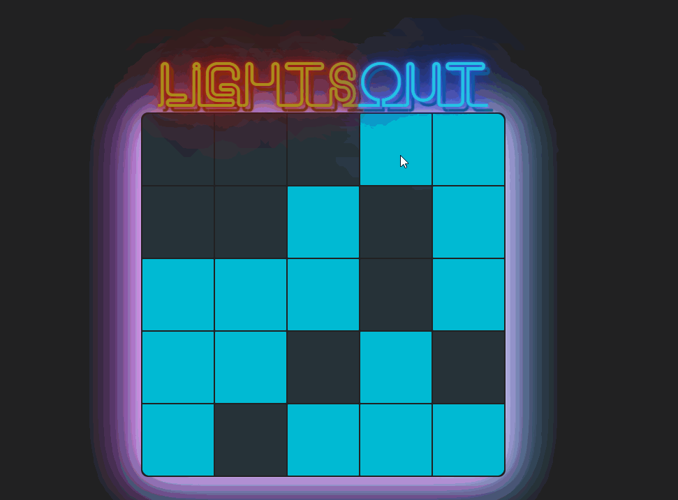

# React Lights Out Game

This repository contains a React implementation of the classic puzzle game **Lights Out**.

## Overview

Lights Out is a puzzle game consisting of a grid of lights that can either be turned on or off. Clicking a light toggles it and its neighboring lights. The goal of the game is to turn all lights off.

## Preview: 




## Features

- Interactive and responsive UI built with React.
- Dynamic board sizes for varying difficulty.
- Modern and clean design for enhanced user experience.
- Real-time state management.

## What I Learned

- State management using React Hooks.
- Managing UI updates and component rendering efficiently.
- Handling complex interactions and events in React.
- Modularizing components for maintainability and clarity.


## Installation

1. Clone the repository:

```bash
git clone https://github.com/mghaithm/React-Lights-Out-Game.git
cd React-Lights-Out-Game
```

2. Install dependencies:

```bash
npm install
```

## Running the App

Start the development server:

```bash
npm start
```

The app will automatically open in your browser at [http://localhost:3000](http://localhost:3000).

## Gameplay

- Click any cell on the grid to toggle it and its neighbors.
- The goal is to turn off all the lights.
- Adjust difficulty by changing the board size.

## Technologies Used

- React
- JavaScript
- CSS
- HTML

